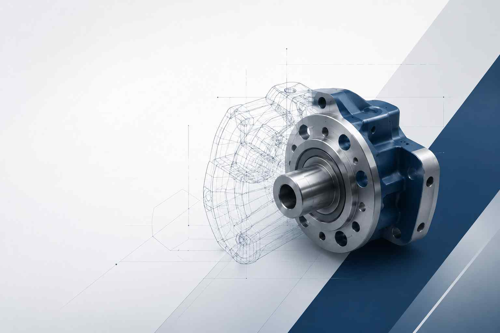

<h2 align="center">
  👋 Portfolio – Ingénieur Mécanique | CAO • Conception • Méthodes • Industrialisation 
  
</h2>

  

🧑‍💼 À propos de moi

Ingénieur en mécanique passionné par la conception industrielle, la CAO et l’optimisation des systèmes de fabrication, je développe des compétences en conception mécanique, méthodes industrielles et industrialisation des produits.

À travers mes projets et expériences, j’interviens sur la modélisation 3D, la mise en plan, l’amélioration des procédés de fabrication ainsi que l’optimisation technique des solutions mécaniques.

Curieux, rigoureux et orienté terrain, je souhaite contribuer à des projets industriels innovants allant de la conception jusqu’à la mise en production.

🛠️ Domaines de compétences

🔧 Conception mécanique & CAO

• Modélisation 3D de pièces et ensembles mécaniques

• Mise en plan et cotation fonctionnelle

• Conception orientée fabrication et assemblage

• Études mécaniques et optimisation de conception

• Logiciels : SolidWorks / CATIA / Creo

🏭 Méthodes & Industrialisation

• Analyse des procédés de fabrication

• Préparation et optimisation de production

• Étude et amélioration de postes de travail

• Réduction des coûts et optimisation des temps

• Introduction aux méthodes Lean Manufacturing

🖨️ Prototypage & Fabrication

• Impression 3D et prototypage rapide

• Fabrication additive

• Validation et amélioration de prototypes

• Approche orientée produit industriel

📊 Outils & Gestion

• Pack Office (Excel, Word, PowerPoint)

• Documentation technique

• Gestion de projet technique

• Analyse et résolution de problèmes industriels

🚀 Projets

📌 Conception mécanique et modélisation CAO
Développement de modèles 3D, mise en plan et optimisation de pièces mécaniques destinées à la fabrication.

📌 Projet d’impression 3D
Conception et réalisation de prototypes fonctionnels avec amélioration continue des performances et de la fabricabilité.

📌 Étude de méthodes industrielles
Analyse de processus de production et propositions d’amélioration pour optimiser l’ergonomie et l’efficacité industrielle.

📁 Contenu du portfolio

• CV professionnel

• Dossier de compétences

• Projets CAO et industriels

• Rendus 3D et visuels techniques

• Documents techniques et études

🎯 Objectif professionnel

Évoluer dans les domaines de la conception mécanique, des méthodes industrielles et de l’industrialisation afin de participer à :

• la conception de produits mécaniques innovants

• l’optimisation des processus industriels

• l’amélioration continue des ateliers de fabrication

• la mise en production de nouveaux produits

📫 Contact

LinkedIn : https://www.linkedin.com/in/zakaria-el-amraoui-876274136/

Email : elamraoui.zakaria94@gmail.com

⭐ Merci de visiter mon portfolio !
